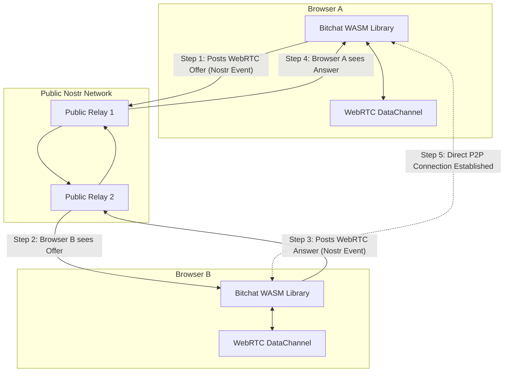

# Browser-to-Browser P2P Architecture

This document describes a decentralized, serverless architecture for establishing direct peer-to-peer communication between two web browsers running the Bitchat WASM library. This approach avoids the need for a dedicated signaling server by creatively using the public Nostr network as a distributed signaling mechanism.

## 1. Overview

The goal is to enable two users to chat directly from their browsers with no intermediary servers handling the messages. This provides maximum privacy, low latency, and true censorship resistance.

To achieve this, we use a hybrid approach:

1.  **WebRTC**: The browser's native peer-to-peer communication framework. We use its `RTCDataChannel` to create a direct, encrypted tunnel between the two browsers for the actual chat messages.
2.  **Nostr**: The public, decentralized Nostr network is used as a signaling layer. Its purpose is solely to allow the two browsers to find each other and exchange the connection information required to establish the WebRTC connection.

Once the WebRTC connection is established, the Nostr network is no longer involved in the communication between the two peers.

## 2. The Challenge: The Browser Sandbox

A browser cannot act as a traditional server due to security restrictions. It cannot open a network port and listen for incoming connections. This prevents a simple client-server or peer-to-peer architecture where one browser directly connects to another's IP address. WebRTC is the solution to this problem, as it is designed to negotiate NAT traversal and firewall punching, but it requires an initial handshake or "signaling" phase to exchange connection details.

## 3. Architecture Diagram

This diagram illustrates the workflow for establishing a connection:

## 4. Detailed Workflow

1.  **Initiation (Browser A)**
    *   User A indicates they want to chat with User B (e.g., by clicking on their contact).
    *   The Bitchat WASM library in Browser A generates a WebRTC "offer" (an SDP string).
    *   The library creates a Nostr event containing this offer. To ensure privacy, this should be an encrypted direct message (Kind 4) sent to User B's Nostr public key.
    *   To make the event discoverable, it is tagged with a specific identifier, e.g., `["t", "bitchat-webrtc-signal-v1"]`.
    *   The event is sent to one or more public Nostr relays.

2.  **Discovery (Browser B)**
    *   The Bitchat WASM library in Browser B is continuously subscribed to the public Nostr network, filtering for encrypted direct messages addressed to it with the `bitchat-webrtc-signal-v1` tag.
    *   It receives the event from Browser A, decrypts it, and extracts the WebRTC offer.

3.  **Response (Browser B)**
    *   Browser B processes the offer and generates a WebRTC "answer".
    *   It then creates its own encrypted Nostr event containing this answer, addressed to Browser A, and posts it back to the public relays.

4.  **Connection (Browser A)**
    *   Browser A receives the answer from Browser B.
    *   At this point, both browsers have exchanged the necessary information (the offer, answer, and ICE candidates that are part of the WebRTC process) to establish a direct connection.

5.  **Communication**
    *   A direct, encrypted `RTCDataChannel` is established between the two browsers.
    *   The Bitchat protocol now runs entirely over this P2P channel. All Bitchat packets are sent through the data channel, providing a low-latency, private communication link.

## 5. Protocol Details for Nostr Signaling

To ensure this process works reliably and doesn't pollute the public Nostr network, the signaling events should follow a specific format:

*   **Event Kind**: Use **ephemeral events (Kind 22242)**. This signals to relays that they do not need to store the event permanently.
*   **Encryption**: The offer and answer should be sent as **encrypted direct messages (Kind 4)** to protect the privacy of the connection details.
*   **Tags**: Use a standardized tag to identify the signaling events, e.g., `["t", "bitchat-webrtc-signal-v1"]`.
*   **Content**: The content of the Nostr event should be a JSON object containing the WebRTC signaling data (e.g., `{ "type": "offer", "sdp": "..." }`).

## 6. Implementation in `bitchat-rust`

This architecture would be implemented by creating a new transport crate:

### `bitchat-webrtc-transport`

*   **Purpose**: A WASM-only crate that implements the `Transport` trait from `bitchat-core`.
*   **Internal Components**:
    1.  **`NostrSignaler`**: This component would be responsible for the signaling phase. It would use the `nostr-sdk` to connect to public relays, post the offer/answer events, and listen for the corresponding responses.
    2.  **`WebRTCManager`**: This component would use the browser's WebRTC APIs (via `web-sys`) to create and manage the `RTCPeerConnection` and the `RTCDataChannel`.
*   **Workflow**:
    1.  When `start()` is called, the `NostrSignaler` connects to the Nostr network.
    2.  When `send_to()` is called for a new peer, the `NostrSignaler` initiates the signaling process.
    3.  Once the signaling is complete, the `WebRTCManager` establishes the data channel.
    4.  The `send_to()` and `receive()` methods of the `Transport` trait would then be implemented to write to and read from the established `RTCDataChannel`.

## 7. Limitations and Trade-offs

*   **Reliance on Public Relays for Discovery**: While you don't need to host your own server, this architecture is still dependent on the availability and reliability of the public Nostr network for the initial handshake.
*   **Initial Connection Latency**: The time it takes to establish the initial connection will be higher than with a dedicated signaling server, as it depends on Nostr event propagation times.
*   **Not Universally Connectable**: WebRTC P2P connections can sometimes fail, especially in restrictive corporate networks. In these cases, a TURN server (which relays the WebRTC traffic) would be needed as a fallback, which reintroduces a server into the architecture.
*   **Browser-Only**: This architecture is designed for browser-to-browser communication and is not compatible with the native BLE transport.

Despite these limitations, this architecture represents a viable and powerful approach to building truly decentralized, peer-to-peer web applications. It cleverly leverages two different decentralized technologies for what they do best: Nostr for censorship-resistant discovery and WebRTC for private, direct communication.
