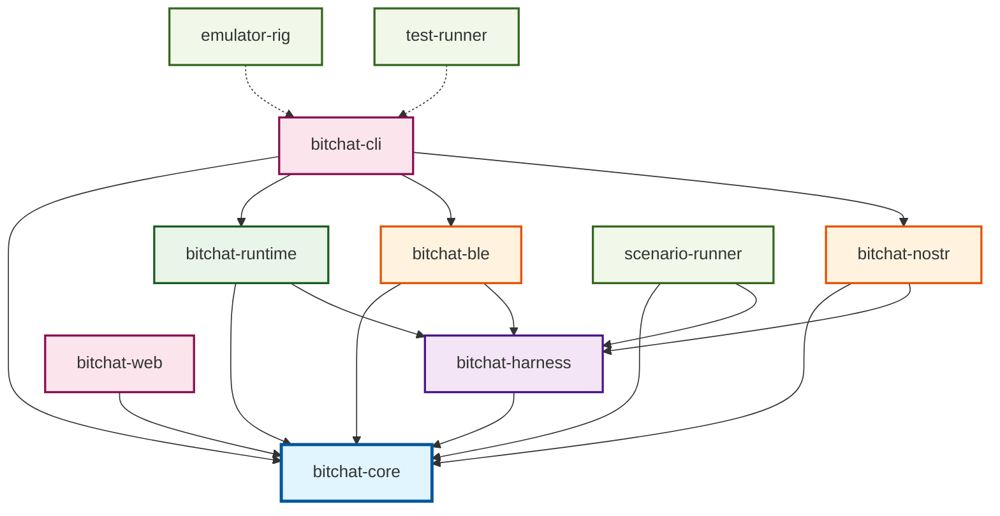

# BitChat Crate Dependency Diagram

This document provides a comprehensive view of the dependency relationships between all crates in the BitChat project, including the core protocol implementation, transport layers, applications, and simulator infrastructure.

## Overview

The BitChat project follows a layered architecture with clear separation of concerns:

1. **Core Layer**: `bitchat-core` - Protocol implementation and cryptographic primitives
2. **Harness Layer**: `bitchat-harness` - Testing framework and transport abstractions  
3. **Runtime Layer**: `bitchat-runtime` - Orchestration and lifecycle management
4. **Transport Layer**: `bitchat-ble`, `bitchat-nostr` - Transport implementations
5. **Application Layer**: `bitchat-cli`, `bitchat-web` - End-user applications
6. **Simulator Layer**: `scenario-runner`, `emulator-rig` - Testing and validation tools

## Dependency Graph

## Detailed Dependency Analysis

### Core Foundation (`bitchat-core`)

**Dependencies**: External crates only
- No internal BitChat dependencies
- Cryptographic libraries: `snow`, `ed25519-dalek`, `x25519-dalek`, `chacha20poly1305`
- Serialization: `serde`, `bincode`
- Async primitives: `tokio` (feature-gated), `futures`

**Role**: Provides the foundational protocol implementation, cryptographic primitives, message types, and core abstractions for the entire BitChat ecosystem.

### Testing Harness (`bitchat-harness`)

**Dependencies**:
- `bitchat-core` - Core protocol types and functionality

**Role**: Provides testing infrastructure, mock transports, and transport lifecycle management. Serves as the foundation for both integration testing and the simulator infrastructure.

### Runtime Orchestration (`bitchat-runtime`)

**Dependencies**:
- `bitchat-core` - Core protocol and types
- `bitchat-harness` - Transport abstractions and utilities

**Role**: Manages the runtime lifecycle, coordinates between transport layers, handles message routing, and provides the main orchestration logic for BitChat applications.

### Transport Implementations

#### BLE Transport (`bitchat-ble`)

**Dependencies**:
- `bitchat-core` - Core protocol implementation
- `bitchat-harness` - Transport abstractions
- `btleplug` - Cross-platform BLE library
- Platform-specific BLE libraries for advertising support

**Role**: Implements Bluetooth Low Energy mesh networking transport with peer discovery, connection management, and message fragmentation for MTU limits.

#### Nostr Transport (`bitchat-nostr`)

**Dependencies**:
- `bitchat-core` - Core protocol implementation  
- `bitchat-harness` - Transport abstractions
- `nostr-sdk` - Nostr protocol implementation (native only)
- WebSocket libraries: `tokio-tungstenite` (native), `ws_stream_wasm` (WASM)

**Role**: Implements Nostr relay-based transport with dual native/WASM support, relay management, and encrypted message routing over the Nostr network.

### Application Layer

#### Web Assembly (`bitchat-web`)

**Dependencies**:
- `bitchat-core` - Core protocol (WASM-compatible subset)
- WASM bindings: `wasm-bindgen`, `js-sys`, `web-sys`

**Role**: Provides WebAssembly bindings for browser environments, exposing BitChat functionality to JavaScript applications.

#### CLI Application (`bitchat-cli`)

**Dependencies**:
- `bitchat-core` - Core protocol
- `bitchat-runtime` - Runtime orchestration
- `bitchat-ble` - BLE transport
- `bitchat-nostr` - Nostr transport

**Role**: Full-featured command-line BitChat client demonstrating the complete protocol stack with both transport layers and automation capabilities.

### Simulator Infrastructure

#### Scenario Runner (`scenario-runner`)

**Dependencies**:
- `bitchat-core` - Core protocol types
- `bitchat-harness` - Testing framework and mock transports

**Role**: Data-driven scenario testing system with TOML-based configuration, network simulation, state validation, and comprehensive test orchestration for protocol validation.

#### Emulator Rig (`emulator-rig`)

**Dependencies**: External tools and utilities only
- No direct BitChat crate dependencies
- Coordinates external mobile emulators and test clients

**Role**: Orchestrates cross-platform emulator testing, manages Android/iOS emulators, and coordinates integration testing across different client implementations.

#### Test Runner (`test-runner`)

**Dependencies**: External tools only
- No direct BitChat crate dependencies  
- Coordinates external test processes

**Role**: Standalone integration test runner that orchestrates cross-client compatibility testing by spawning and coordinating multiple BitChat client processes.

## Key Architectural Principles

### 1. **Layered Dependencies**
- Clear bottom-up dependency flow from core → harness → runtime → applications
- No circular dependencies between BitChat crates
- External simulator tools remain decoupled from internal crates

### 2. **Transport Independence**  
- Transport implementations depend only on core + harness layers
- Runtime layer remains transport-agnostic
- Applications can choose which transports to include

### 3. **Platform Flexibility**
- Core protocol supports `no_std`, `std`, and `wasm` features
- Transport layers adapt to platform capabilities
- Clear separation between native and WASM codepaths

### 4. **Testing Integration**
- Comprehensive testing infrastructure built into the dependency hierarchy
- Mock implementations at the harness layer enable deterministic testing
- Simulator tools operate independently for cross-client validation

### 5. **Minimal Dependencies**
- Each crate includes only necessary dependencies for its role
- Feature flags enable platform-specific functionality
- Clean separation prevents dependency bloat in constrained environments

## Build Targets and Feature Matrix

| Crate | `std` | `wasm` | `testing` | Platform Support |
|-------|-------|--------|-----------|------------------|
| `bitchat-core` | ✓ | ✓ | ✓ | Universal |
| `bitchat-harness` | ✓ | ✓ | ✓ | Universal |
| `bitchat-runtime` | ✓ | ✓ | ✓ | Universal |
| `bitchat-ble` | ✓ | ✗ | ✓ | Native only |
| `bitchat-nostr` | ✓ | ✓ | ✓ | Universal |
| `bitchat-web` | ✗ | ✓ | ✗ | WASM only |
| `bitchat-cli` | ✓ | ✗ | ✗ | Native only |
| `scenario-runner` | ✓ | ✗ | ✓ | Native only |
| `emulator-rig` | ✓ | ✗ | ✗ | Native only |

This dependency structure ensures that the BitChat protocol can be deployed across a wide range of environments while maintaining clear architectural boundaries and enabling comprehensive testing at all levels of the stack.