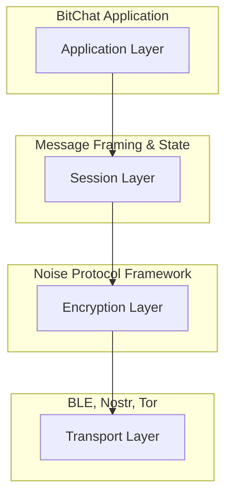

# Bitchat Protocol Architecture

## 1. Overview

Bitchat is a decentralized, peer-to-peer messaging protocol designed for secure, private, and censorship-resistant communication. It operates primarily over a Bluetooth Low Energy (BLE) mesh network with fallback to the Nostr network when direct communication is not possible. All communication is end-to-end encrypted using the Noise Protocol Framework.

The design goals of the Bitchat Protocol are:

- **Confidentiality:** All communication must be unreadable to third parties.
- **Authentication:** Users must be able to verify the identity of their correspondents.
- **Integrity:** Messages cannot be tampered with in transit.
- **Forward Secrecy:** The compromise of long-term identity keys must not compromise past session keys.
- **Deniability:** It should be difficult to cryptographically prove that a specific user sent a particular message.
- **Resilience:** The protocol must function reliably in lossy, low-bandwidth environments.

## 2. Protocol Stack

The Bitchat Protocol is organized as a four-layer stack. This layered approach separates concerns, allowing for modularity and future extensibility.



- **Application Layer:** Defines the structure of user-facing messages (`BitchatMessage`), file transfers, acknowledgments (`DeliveryAck`, `ReadReceipt`), and other application-level data.
- **Session Layer:** Manages the overall communication packet (`BitchatPacket`). This includes routing information (TTL), message typing, fragmentation, version negotiation, and serialization into a compact binary format.
- **Encryption Layer:** Establishes and manages secure channels using the Noise Protocol Framework. Responsible for cryptographic handshake, session management, and transport message encryption/decryption.
- **Transport Layer:** The underlying physical medium used for data transmission, such as Bluetooth Low Energy (BLE), Nostr relays (with Tor routing), or other transports. This layer is abstracted from the core protocol.

## 3. Protocol Lifecycle

The following diagram illustrates the complete lifecycle of a Bitchat session between two peers, from initial connection through encrypted messaging to eventual disconnection.

```mermaid
sequenceDiagram
    participant A as Peer A
    participant BLE as BLE Transport
    participant B as Peer B
    
    Note over A,B: Phase 1: Connection & Discovery
    A->>BLE: Start BLE advertising (nickname + Noise pubkey)
    B->>BLE: Start BLE scanning
    BLE-->>B: Discover Peer A
    B->>A: Establish BLE connection
    
    Note over A,B: Phase 2: Protocol Version Negotiation
    A->>B: VERSION_HELLO (supported versions)
    B->>A: VERSION_ACK (agreed version)
    
    Note over A,B: Phase 3: Noise XX Handshake
    B->>A: NOISE_HANDSHAKE_INIT (ephemeral key e_b)
    Note right of A: A generates ephemeral key e_a<br/>Performs DH(e_a, e_b)
    A->>B: NOISE_HANDSHAKE_RESP (e_a, encrypted s_a)
    Note left of B: B decrypts s_a<br/>Performs DH operations
    B->>A: NOISE_HANDSHAKE_FINAL (encrypted s_b)
    Note over A,B: Noise session established<br/>Shared transport keys derived
    
    Note over A,B: Phase 4: Identity Announcement
    A->>B: ANNOUNCE (signed, contains: nickname, Noise pubkey, Ed25519 pubkey, direct neighbors)
    B->>A: ANNOUNCE (signed, contains: nickname, Noise pubkey, Ed25519 pubkey, direct neighbors)
    Note over A,B: Peers now know each other's identities<br/>Can update mesh topology view
    
    Note over A,B: Phase 5: Initial Sync (5 seconds after first announcement)
    B->>A: REQUEST_SYNC (GCS filter of recent packets, TTL=0)
    Note right of A: A checks filter<br/>Identifies missing packets
    A->>B: Missing ANNOUNCE & MESSAGE packets (TTL=0)
    
    Note over A,B: Phase 6: Encrypted Messaging
    A->>B: NOISE_ENCRYPTED (BitchatMessage payload)
    Note left of B: B decrypts message<br/>Displays to user
    B->>A: DELIVERY_ACK (message ID)
    B->>A: READ_RECEIPT (message ID, when viewed)
    
    B->>A: NOISE_ENCRYPTED (BitchatMessage payload)
    Note right of A: A decrypts message<br/>Displays to user
    A->>B: DELIVERY_ACK (message ID)
    
    Note over A,B: Phase 7: File Transfer (optional)
    A->>B: FILE_TRANSFER (FRAGMENT_START, metadata)
    A->>B: FILE_TRANSFER (FRAGMENT_CONTINUE, chunk 1)
    A->>B: FILE_TRANSFER (FRAGMENT_CONTINUE, chunk 2)
    A->>B: FILE_TRANSFER (FRAGMENT_END, final chunk)
    Note left of B: B reassembles file<br/>Saves to local storage
    B->>A: DELIVERY_ACK (transfer ID)
    
    Note over A,B: Phase 8: Periodic Sync (every 30 seconds)
    A->>B: REQUEST_SYNC (GCS filter, TTL=0)
    B->>A: Missing packets (TTL=0)
    B->>A: REQUEST_SYNC (GCS filter, TTL=0)
    A->>B: Missing packets (TTL=0)
    
    Note over A,B: Phase 9: Mesh Relay (to indirect peers)
    A->>B: NOISE_ENCRYPTED (for Peer C, TTL=7)
    Note left of B: B checks: not for me<br/>Decrements TTL<br/>Relays to neighbors
    B->>BLE: Broadcast to mesh (TTL=6)
    
    Note over A,B: Phase 10: Session Maintenance
    Note over A,B: After 1 hour or 10,000 messages:<br/>Automatic rekey (new Noise handshake)
    A->>B: NOISE_HANDSHAKE_INIT (new session)
    B->>A: NOISE_HANDSHAKE_RESP
    A->>B: NOISE_HANDSHAKE_FINAL
    Note over A,B: New transport keys established<br/>Old session destroyed
    
    Note over A,B: Phase 11: Graceful Disconnection
    A->>B: LEAVE (notification)
    Note left of B: B removes A's announcement<br/>Closes Noise session
    B->>BLE: Close BLE connection
    
    Note over A,B: Phase 12: Timeout/Error Disconnect
    Note over B: No packets from A for 60s
    Note over B: B blocks A's MAC for 15 min<br/>Closes connection
```



### 3.1. Lifecycle Phases

**Phase 1: Connection & Discovery**
- Peers advertise their presence via BLE with nickname and Noise public key
- Other peers scan and establish BLE connections

**Phase 2: Protocol Version Negotiation**
- Peers exchange `VERSION_HELLO` messages with supported protocol versions
- Agree on highest common version via `VERSION_ACK`
- Legacy peers default to v1 if they don't support negotiation

**Phase 3: Noise XX Handshake**
- Three-message handshake establishes mutually authenticated, encrypted session
- Ephemeral keys provide forward secrecy
- Static keys exchanged encrypted for identity authentication
- Transport cipher keys derived for bidirectional communication

**Phase 4: Identity Announcement**
- After Noise session established, peers send signed `ANNOUNCE` messages
- Contains nickname, public keys, and optionally direct neighbor information
- Signatures provide non-repudiation and integrity
- Peers can now verify fingerprints and update local petnames

**Phase 5: Initial Sync**
- 5 seconds after receiving first announcement from a new peer
- Targeted `REQUEST_SYNC` sent with GCS filter of recently seen packets
- Ensures new connection quickly converges on recent mesh state
- Local-only (TTL=0), not relayed beyond direct connection

**Phase 6: Encrypted Messaging**
- All application messages encrypted in `NOISE_ENCRYPTED` packets
- Private messages addressed to specific recipient
- Broadcast messages use all-0xFF recipient ID
- Delivery and read receipts provide reliability feedback

**Phase 7: File Transfer (Optional)**
- Images, audio, and files transferred via `FILE_TRANSFER` packets
- Large files fragmented to fit BLE MTU
- Progress tracking via transfer IDs
- Cancellation supported mid-transfer

**Phase 8: Periodic Sync**
- Every 30 seconds, broadcast `REQUEST_SYNC` to all neighbors
- GCS filter enables efficient identification of missing packets
- Ensures eventual consistency across mesh
- Local-only (TTL=0)

**Phase 9: Mesh Relay**
- Packets for indirect peers relayed through the mesh
- TTL decremented at each hop to prevent infinite loops
- Bloom filters prevent re-broadcasting seen packets
- Optional source routing for known topology paths

**Phase 10: Session Maintenance**
- Automatic rekey after 1 hour or 10,000 messages
- Maintains forward secrecy over long sessions
- New handshake performed transparently
- Old session keys securely destroyed

**Phase 11: Graceful Disconnection**
- Peer sends `LEAVE` message before disconnecting
- Recipients immediately remove stored announcement
- Noise session closed and keys destroyed
- BLE connection terminated cleanly

**Phase 12: Timeout/Error Disconnect**
- No packets for 60 seconds triggers disconnection
- No `ANNOUNCE` within 15 seconds of connection triggers block
- 5+ error disconnects in 5 minutes triggers 15-minute MAC block
- Protects against misbehaving or malicious devices

## 4. Identity and Key Management

A peer's identity in Bitchat is defined by two persistent cryptographic key pairs, generated on first launch and stored securely in the device's Keychain.

### 4.1. Key Pairs

1. **Noise Static Key Pair (`Curve25519`):** The long-term identity key used for the Noise Protocol handshake. The public part of this key is shared with peers to establish secure sessions.
2. **Signing Key Pair (`Ed25519`):** Used to sign announcements and other protocol messages where non-repudiation is required, such as binding a public key to a nickname.

### 4.2. Fingerprint

A user's unique, verifiable fingerprint is the **SHA-256 hash** of their **Noise static public key**. This provides a user-friendly and secure way to verify identity out-of-band (e.g., by reading it aloud or scanning a QR code).

```
Fingerprint = SHA256(StaticPublicKey_Curve25519)
```

### 4.3. Identity Management

The `SecureIdentityStateManager` class manages all cryptographic identity material and social metadata (petnames, trust levels, etc.). It uses an in-memory cache for performance and persists this cache to the Keychain after encrypting it with AES-GCM.

## 5. Social Trust Layer

Beyond cryptographic identity, Bitchat incorporates a social trust layer, allowing users to manage their relationships with peers.

### 5.1. Peer Verification

While the Noise handshake cryptographically authenticates a peer's key, it doesn't confirm the real-world identity. Users can perform out-of-band (OOB) verification by comparing fingerprints. Once confirmed, they can mark that peer as "verified". This status is stored locally and displayed in the UI.

### 5.2. Favorites and Blocking

- **Favorites:** Users can mark trusted or frequently contacted peers as "favorites". This is a local designation used to prioritize notifications or display peers more prominently. Favorites can also enable Nostr fallback for that peer.
- **Blocking:** Users can block peers. When a peer is blocked, the application discards any incoming packets from that peer's fingerprint at the earliest possible stage, without notifying the blocked peer.

## 6. Encryption Layer: The Noise Protocol

Bitchat implements the Noise Protocol Framework to provide strong, authenticated end-to-end encryption.

### 6.1. Protocol Name

The specific Noise protocol implemented is:

**`Noise_XX_25519_ChaChaPoly_SHA256`**

- **`XX` Pattern:** This handshake pattern provides mutual authentication and forward secrecy. Neither party needs to know the other's static public key before the handshake begins. Keys are exchanged and authenticated during the three-part handshake. This is ideal for a decentralized P2P environment.
- **`25519`:** The Diffie-Hellman function used is Curve25519 (X25519).
- **`ChaChaPoly`:** The AEAD cipher is ChaCha20-Poly1305.
- **`SHA256`:** The hash function used for all cryptographic hashing operations is SHA-256.
- **KDF:** HKDF-SHA256 for key derivation.

### 6.2. The `XX` Handshake

The `XX` handshake consists of three messages exchanged between an Initiator and a Responder:

```
XX:
  -> e
  <- e, ee, s, es
  -> s, se
```

**Handshake Flow:**

1. **Initiator -> Responder:** The initiator generates a new ephemeral key pair (`e_i`) and sends the public part to the responder.
2. **Responder -> Initiator:** The responder receives the initiator's ephemeral public key, generates its own ephemeral key pair (`e_r`), performs a DH exchange with the initiator's ephemeral key (`ee`), sends its own static public key (`s_r`) encrypted with the resulting symmetric key, and performs another DH exchange between the initiator's ephemeral key and its own static key (`es`).
3. **Initiator -> Responder:** The initiator receives the responder's message, decrypts the responder's static key, authenticates it, then sends its own static key (`s_i`) encrypted and performs a final DH exchange between its static key and the responder's ephemeral key (`se`).

Upon completion, both parties share a set of symmetric keys for bidirectional transport message encryption.

### 6.3. Session Management

Sessions are managed with automatic cleanup and rekey support:

- **Session Lookup:** Sessions are indexed by peer ID and persisted across peer ID rotations through fingerprint mapping.
- **Automatic Cleanup:** Stale sessions are removed on disconnect.
- **Rekey Detection:** Automatic rekey after 1 hour or 10,000 messages to maintain forward secrecy.
- **Rate Limiting:** The `NoiseRateLimiter` prevents resource exhaustion from rapid, repeated handshake attempts.

### 6.4. Session Persistence Across Peer ID Rotation

Noise sessions persist across peer ID rotations through fingerprint mapping. After handshake completion, peers exchange identity announcements containing their current peer ID, public key, nickname, and optional previous peer ID, all signed with their Ed25519 key.

### 6.5. Security Properties

- **Forward Secrecy:** Ephemeral keys are generated for each handshake. Past sessions cannot be decrypted with current keys.
- **Authentication:** Static keys provide long-term identity. Handshake ensures mutual authentication. MAC tags prevent message tampering.
- **Privacy:** Peer identities are encrypted during handshake. Metadata minimization through padding. No persistent session identifiers.
- **Replay Protection:** Noise transport messages include a nonce that is incremented for each message. A sliding window replay protection mechanism detects and discards replayed or out-of-order messages.

## 7. Session Layer: Binary Packet Format

Once a Noise session is established, peers exchange `BitchatPacket` structures, which are encrypted as the payload of Noise transport messages.

### 7.1. Protocol Versions

Bitchat implements protocol version negotiation to ensure compatibility:

- **v1:** Original protocol with 2-byte payload length (max 64 KiB)
- **v2:** Extended protocol with 4-byte payload length (max ~4 GiB)

Version negotiation flow:
1. **Version Hello (0x20):** Upon connection, peers exchange supported protocol versions
2. **Version Ack (0x21):** Peers agree on the highest common version
3. **Graceful Fallback:** Legacy peers without version negotiation assume protocol v1

### 7.2. Packet Header Format

**v1 Format (13 bytes):**
```
Version: 1 byte (set to 1)
Type: 1 byte
TTL: 1 byte
Timestamp: 8 bytes (UInt64, big-endian, milliseconds since epoch)
Flags: 1 byte
PayloadLength: 2 bytes (UInt16, big-endian, max 64 KiB)
```

**v2 Format (15 bytes):**
```
Version: 1 byte (set to 2)
Type: 1 byte
TTL: 1 byte
Timestamp: 8 bytes (UInt64, big-endian, milliseconds since epoch)
Flags: 1 byte
PayloadLength: 4 bytes (UInt32, big-endian, max ~4 GiB)
```

### 7.3. Complete Packet Structure

| Field           | Size (bytes) | Description                                                                                             |
|-----------------|--------------|---------------------------------------------------------------------------------------------------------|
| **Header**      | **13-15**    | **Fixed-size header (depends on version)**                                                              |
| Version         | 1            | Protocol version (`1` or `2`).                                                                          |
| Type            | 1            | Message type (see MessageType enum below).                                                              |
| TTL             | 1            | Time-To-Live for mesh network routing. Decremented at each hop.                                         |
| Timestamp       | 8            | `UInt64` millisecond timestamp of packet creation.                                                      |
| Flags           | 1            | Bitmask for optional fields (`hasRecipient`, `hasSignature`, `isCompressed`, `hasRoute`).               |
| Payload Length  | 2 or 4       | `UInt16` (v1) or `UInt32` (v2) length of the payload field.                                            |
| **Variable**    | **...**      | **Variable-size fields**                                                                                |
| Sender ID       | 8            | 8-byte truncated peer ID of the sender.                                                                 |
| Recipient ID    | 8 (optional) | 8-byte truncated peer ID of the recipient. Present if `hasRecipient` flag is set. Broadcast if all `0xFF`. |
| Route           | Variable     | Optional source routing (see Source Routing section). Present if `hasRoute` flag is set.                |
| Payload         | Variable     | The actual content of the packet, as defined by the `Type` field.                                       |
| Signature       | 64 (optional)| `Ed25519` signature of the packet. Present if `hasSignature` flag is set.                               |

**Padding:** All packets are padded to the next standard block size (256, 512, 1024, or 2048 bytes) using a PKCS#7-style scheme to obscure the true message length from network observers.

### 7.4. Flags

The `Flags` field is a bitmask:

- `0x01` `HAS_RECIPIENT`: Recipient ID field is present
- `0x02` `HAS_SIGNATURE`: Signature field is present
- `0x04` `IS_COMPRESSED`: Payload is compressed (zlib)
- `0x08` `HAS_ROUTE`: Source routing information is present

## 8. Message Types

The `Type` field in the packet header indicates the type of the message:

| Type | Hex  | Name                      | Description                                                    |
|------|------|---------------------------|----------------------------------------------------------------|
| 1    | 0x01 | `ANNOUNCE`                | Peer presence announcement with identity information           |
| 4    | 0x04 | `MESSAGE`                 | Regular chat message                                           |
| 16   | 0x10 | `NOISE_HANDSHAKE_INIT`    | Initiation of a Noise protocol handshake                       |
| 17   | 0x11 | `NOISE_HANDSHAKE_RESP`    | Response to a Noise protocol handshake                         |
| 18   | 0x12 | `NOISE_ENCRYPTED`         | Message encrypted with the Noise protocol                      |
| 32   | 0x20 | `VERSION_HELLO`           | Protocol version negotiation hello                             |
| 33   | 0x21 | `VERSION_ACK`             | Protocol version negotiation acknowledgment                    |
| 33   | 0x21 | `REQUEST_SYNC`            | GCS filter sync request (gossip synchronization)               |
| 34   | 0x22 | `FILE_TRANSFER`           | File transfer (images, audio, generic files)                   |
| -    | 0x05 | `DELIVERY_ACK`            | Delivery acknowledgment for private messages                   |
| -    | 0x06 | `READ_RECEIPT`            | Read receipt for messages                                      |
| -    | 0x07 | `LEAVE`                   | Peer leaving notification                                      |
| -    | 0x0A | `FRAGMENT_START`          | Start of a fragmented message                                  |
| -    | 0x0B | `FRAGMENT_CONTINUE`       | Continuation of a fragmented message                           |
| -    | 0x0C | `FRAGMENT_END`            | End of a fragmented message                                    |

## 9. Application Layer: Message Format

For packets of type `MESSAGE`, the payload is a binary-serialized `BitchatMessage` containing the chat content.

| Field               | Size (bytes) | Description                                                              |
|---------------------|--------------|--------------------------------------------------------------------------|
| Flags               | 1            | Bitmask for optional fields (`isRelay`, `isPrivate`, `hasOriginalSender`). |
| Timestamp           | 8            | `UInt64` millisecond timestamp of message creation.                      |
| ID                  | 1 + len      | `UUID` string for the message.                                           |
| Sender              | 1 + len      | Nickname of the sender.                                                  |
| Content             | 2 + len      | The UTF-8 encoded message content.                                       |
| Original Sender     | 1 + len (opt)| Nickname of the original sender if the message is a relay.               |
| Recipient Nickname  | 1 + len (opt)| Nickname of the recipient for private messages.                          |

## 10. Announcement Protocol

Announcements are used to broadcast peer presence and identity information on the network.

### 10.1. ANNOUNCE Packet

The ANNOUNCE packet (type `0x01`) contains TLV-encoded identity information:

| TLV Type | Name                  | Size (bytes) | Description                                            |
|----------|-----------------------|--------------|--------------------------------------------------------|
| 0x01     | `NICKNAME`            | Variable     | UTF-8 string (≤ 255 bytes)                             |
| 0x02     | `NOISE_PUBLIC_KEY`    | 32           | Noise static public key bytes (Curve25519)             |
| 0x03     | `SIGNING_PUBLIC_KEY`  | 32           | Ed25519 public key bytes                               |
| 0x04     | `DIRECT_NEIGHBORS`    | Variable     | Up to 10 directly connected peer IDs (8 bytes each)    |

### 10.2. Direct Neighbors Gossip (Optional)

The optional `DIRECT_NEIGHBORS` TLV (`0x04`) allows peers to gossip which other peers they are currently connected to directly over Bluetooth. This enables topology visualization and improved routing decisions.

- **Format:** Concatenation of up to 10 peer IDs, each encoded as exactly 8 bytes
- **Purpose:** Build a mesh topology view (nodes = peers, edges = direct connections)
- **Backward Compatibility:** Unknown TLVs are ignored by older implementations

## 11. Message Routing and Propagation

Bitchat operates as a decentralized mesh network with no central servers. Packets are propagated peer-to-peer through the network.

### 11.1. Direct Connection

If Peer A and Peer B are directly connected, they can exchange packets after establishing a mutually authenticated Noise session. All packets are encrypted using the transport ciphers derived from the handshake.

### 11.2. Efficient Gossip with Bloom Filters

To send messages to peers that are not directly connected, Bitchat employs a flooding/gossip protocol:

1. A peer receives a packet.
2. It checks an `OptimizedBloomFilter` to see if the packet's ID has likely been seen before. If so, the packet is discarded.
3. If the packet is new, its ID is added to the Bloom filter.
4. The peer decrements the packet's Time-To-Live (TTL) field.
5. If the TTL is greater than zero, the peer re-broadcasts the packet to all connected peers, *except* the peer from which it received the packet.

This mechanism allows packets to flood through the network efficiently while using minimal resources to prevent loops.

### 11.3. Time-To-Live (TTL)

Every `BitchatPacket` contains an 8-bit TTL field. This value is set by the originating peer and is decremented by one at each relay hop. If a peer receives a packet and decrements its TTL to 0, it will process the packet (if it is the recipient) but will not relay it further.

Typical TTL values:
- Broadcast messages: `MAX_TTL` (implementation-defined, typically 7)
- Private messages: 7 hops
- Encrypted relays: capped at 2 hops to limit metadata spread

### 11.4. Private vs. Broadcast Messages

- **Private Messages:** A packet with a specific `recipientID` is a private message. Relay nodes forward the entire, encrypted Noise message without being able to access the inner `BitchatPacket` or its payload. Only the final recipient can decrypt the packet.
- **Broadcast Messages:** A packet with the special broadcast `recipientID` (all `0xFF` bytes) is intended for all peers. Any peer that receives and decrypts a broadcast message will process its content and relay it according to the flooding algorithm.

### 11.5. Message Reliability

To function in unreliable, lossy networks, the protocol includes features to track message lifecycle:

- **Delivery Acknowledgments (`DeliveryAck`):** When a private message reaches its final destination, the recipient sends a `DeliveryAck` packet back to the original sender containing the ID of the original message.
- **Read Receipts (`ReadReceipt`):** After a message is displayed on the recipient's screen, the application can send a `ReadReceipt` containing the original message ID.
- **Message Retry Service:** Senders maintain a `MessageRetryService` which tracks outgoing messages. If a `DeliveryAck` is not received within a certain time window, the service automatically re-sends the message.

### 11.6. Source-Based Routing (Optional)

An optional extension allows senders to attach a hop-by-hop route (list of peer IDs) to instruct relays on the intended path:

- **Flag:** `HAS_ROUTE (0x08)` indicates the presence of routing information
- **Format:** 1 byte count + (count × 8 bytes) peer IDs
- **Behavior:** Relays attempt targeted unicast to the next hop if directly connected, otherwise fall back to broadcast relaying
- **Computation:** Uses Dijkstra's shortest path on the learned mesh topology

## 12. Fragmentation

Transport layers like BLE have a Maximum Transmission Unit (MTU) that limits the size of a single packet. To handle larger messages, Bitchat implements a fragmentation protocol:

- **`FRAGMENT_START (0x0A)`:** Marks the beginning of a fragmented message. Contains metadata about total size and number of fragments.
- **`FRAGMENT_CONTINUE (0x0B)`:** Carries intermediate chunks of message data.
- **`FRAGMENT_END (0x0C)`:** Carries the final chunk and signals the receiver to begin reassembly.

Receiving peers collect all fragments and reassemble them in the correct order before passing the complete message up to the application layer.

Fragmentation features:
- **Progress Reporting:** Transfer progress events track fragment transmission
- **Cancellation:** Transfers can be cancelled mid-flight
- **Inter-fragment Delay:** ~200ms delay between fragments for stability

## 13. File Transfer Protocol

Bitchat supports file transfer for images, audio (voice notes), and generic files using a TLV-based payload format.

### 13.1. File Transfer Packet

File transfers use message type `FILE_TRANSFER (0x22)` with a TLV-encoded payload:

| TLV Type | Name          | Encoding                    | Description                                    |
|----------|---------------|-----------------------------|------------------------------------------------|
| 0x01     | `FILE_NAME`   | type(1) + len(2) + value    | UTF-8 filename                                 |
| 0x02     | `FILE_SIZE`   | type(1) + len(2) + value(4) | UInt32 file size (big-endian)                  |
| 0x03     | `MIME_TYPE`   | type(1) + len(2) + value    | MIME type (e.g., `image/jpeg`, `audio/mp4`)    |
| 0x04     | `CONTENT`     | type(1) + len(4) + value    | Raw file bytes (4-byte length for large files) |

### 13.2. File Types

**Audio (Voice Notes):**
- Format: AAC in MP4 container (`audio/mp4`)
- Sample rate: 44100 Hz, mono, ~32 kbps
- Storage: `files/voicenotes/incoming/` and `outgoing/`
- UI: Waveform visualization (120 bins), interactive seeking, play/pause controls

**Images:**
- Format: JPEG, downscaled to 512px longest edge, 85% quality
- Storage: `files/images/incoming/` and `outgoing/`
- UI: Block-reveal progress visualization during send, fullscreen viewer

**Generic Files:**
- Storage: `files/files/incoming/`
- UI: File pill with icon and filename

### 13.3. File Transfer Features

- **Progress Tracking:** Transfer ID derived from `sha256(payload)` for progress events
- **Cancellation:** Mid-flight transfer cancellation supported
- **Interactive Waveform Seeking:** Tap anywhere on audio waveforms to jump to that playback position
- **Large File Support:** v2 protocol enables multi-GiB file transfers through fragmentation

## 14. GCS Filter Sync (Gossip Synchronization)

Bitchat implements a gossip-based synchronization feature inspired by Plumtree to ensure eventual consistency of public packets across nodes.

### 14.1. Overview

- Each node maintains a rolling set of recently seen public packets (broadcast messages and announcements)
- Default retention: 100 recent packets (configurable)
- Every 30 seconds, nodes send a `REQUEST_SYNC` packet to immediate neighbors
- Additionally, 5 seconds after first announcement from a newly connected peer, send a targeted `REQUEST_SYNC`
- Synchronization is strictly local (TTL=0, not relayed)

### 14.2. Packet ID

Deterministic packet ID for comparison:
```
ID = first 16 bytes of SHA-256(type | senderID | timestamp | payload)
```

### 14.3. GCS Filter

Golomb-Coded Set (GCS) filter provides compact representation:
- Parameters: size (128-1024 bytes, default 256), target FPR (0.1%-5%, default 1%)
- Hashing: h64 = first 8 bytes of SHA-256(16-byte Packet ID)
- Encoding: Golomb-Rice with parameter P, MSB-first bit packing

### 14.4. REQUEST_SYNC Packet

Type: `REQUEST_SYNC (0x21)`

TLV Payload:
- `0x01`: P (uint8) — Golomb-Rice parameter
- `0x02`: M (uint32) — hash range N × 2^P
- `0x03`: data — GCS bitstream

### 14.5. Sync Behavior

**Sender:**
- Periodic: every 30 seconds, broadcast to immediate neighbors (TTL=0)
- Initial: 5 seconds after first announcement from new peer, unicast (TTL=0)

**Receiver:**
- Decode GCS filter and check locally stored packet IDs
- Send missing packets back with TTL=0 to requester only
- For announcements: send only the latest per sender peer ID
- For broadcast messages: send all missing ones

**Announcement Retention:**
- Store only most recent announcement per peer ID
- Age-out: remove announcements older than 60 seconds
- Pruning: every 15 seconds
- LEAVE handling: immediately remove announcement when peer leaves

## 15. Transport Layer

### 15.1. Bluetooth Low Energy (BLE)

Primary transport for mesh networking:

**Privacy Considerations:**
- **Announce content**: Unchanged — nickname + Noise public key only.
- **Local Name**: Not used (explicitly disabled). Avoids leaking device/OS identity.
- **Address**: iOS uses BLE MAC randomization; BitChat does not attempt to set static addresses.
- **Announce jitter**: Each announce is delayed by a small random jitter to avoid synchronization-based correlation.
- **Scanning**: Foreground scanning uses "allow duplicates" briefly to improve discovery latency; background uses standard scanning parameters.
- **RSSI gating**: The acceptance threshold adapts to nearby density (approx. -95 to -80 dBm) to reduce long-distance observations in dense areas and improve connectivity in sparse ones.
- **Fragmentation**: Fragments use write-with-response for reliability (less re-broadcast churn = fewer repeated signals).
- **GATT permissions**: Private characteristic disallows .read; we use notify/write/writeWithoutResponse to avoid exposing plaintext attributes over GATT.

**Device Monitoring:**
- Blocklist management for problematic devices
- Drop connections with no ANNOUNCE within 15 seconds
- Drop connections with no packets for 60 seconds
- Block devices with 5 error disconnects within 5 minutes
- Auto-unblock after 15 minutes

### 15.2. Nostr Fallback

When direct BLE connection is not available, Bitchat can use the Nostr network:

**Usage Criteria:**
- Only attempted for mutual favorites or where a Nostr key has been exchanged
- Prefer mesh when available

**Protocol:**
- **NIP-17:** Private Direct Messages using "gift-wrapped" messages for enhanced privacy
- **NIP-44:** Encrypted Direct Messages (version 2)
- **Payload:** BitChat Noise-encrypted packet embedded inside NIP-17 gift wrap
- **Timestamp Handling:** Random offsets to reduce timing correlation
- **Read/Delivery Acks:** Also encapsulated in gift wraps

**Privacy:**
- Relays see only random-looking ciphertext
- End-to-end Noise encryption encapsulated in gift wraps
- Throttling: read acks rate-limited (~3/s) to prevent relay rate limits

### 15.3. Tor Integration

All Nostr network traffic is routed via a local Tor SOCKS5 proxy by default:

- **Fail-Closed:** No network traffic until Tor is bootstrapped
- **SOCKS Proxy:** 127.0.0.1:39050
- **Configuration:** Minimal torrc (ClientOnly, AvoidDiskWrites, MaxClientCircuitsPending 8)
- **Dev Bypass:** `BITCHAT_DEV_ALLOW_CLEARNET` flag for local development only
- **TorManager**: Boots Tor, manages a DataDirectory under Application Support, exposes SOCKS at 127.0.0.1:39050, and provides awaitReady().
- **TorURLSession**: Provides a shared URLSession configured with a SOCKS5 proxy when Tor is enforced/ready.

## 16. Security Considerations

### 16.1. Cryptographic Security

- **Replay Attacks:** Noise transport messages include nonces with sliding window replay protection
- **Key-Compromise Impersonation:** The `XX` pattern authenticates both parties
- **Forward Secrecy:** Ephemeral keys for each handshake, automatic rekey after 1 hour or 10,000 messages
- **Denial of Service:** Rate limiting prevents resource exhaustion from rapid handshake attempts

### 16.2. Network Privacy

- **Traffic Analysis:** Fixed-size padding obscures message content and nature
- **BLE Privacy:** MAC randomization, minimal announce content, jitter to reduce correlation
- **Metadata Minimization:** No plaintext identity beyond user-broadcasted nickname
- **Tor Routing:** All Nostr traffic routed through Tor by default
- **TTL Limits:** Encrypted relays capped at 2 hops to limit metadata spread

### 16.3. Identity and Trust

- **Identity Binding:** Noise handshake authenticates keys, but users must verify fingerprints out-of-band to prevent MITM attacks
- **Signature Verification:** Ed25519 signatures on announcements and critical messages
- **Blocking:** Early packet discard for blocked peers
- **Panic Action:** Triple-tap clears keys, sessions, cached state, and disconnects transports

### 16.4. Data Retention

- **Messages:** Ephemeral in-memory only; history is bounded per chat and trimmed.
- **Read-receipt IDs:** Stored in `UserDefaults` for UX continuity; periodically pruned to IDs present in memory.
- **Favorites:** Noise and optional Nostr keys with petnames; can be wiped via panic action.
- **Panic:** Triple-tap clears keys, sessions, cached state, and disconnects transports.
- **Logging:** Centralized `SecureLogger` filters potential secrets and uses OSLog privacy markers. Default level: `info`; release builds suppress debug. Developers can set `BITCHAT_LOG_LEVEL=debug|info|warning|error|fault`.

## 17. Data Models

The following are the core data models used in the Bitchat protocol:

- **`BitchatMessage`:** Represents a single chat message with content, sender, timestamp, and flags
- **`BitchatPacket`:** Represents a single Bitchat packet with header, payload, and optional signature
- **`BitchatPeer`:** Represents a peer in the network with identity, connection status, and trust level
- **`PeerID`:** Represents the unique ID of a peer (8-byte truncated identifier)
- **`BitchatFilePacket`:** Represents a file transfer with TLV-encoded metadata and content
- **`NoiseSession`:** Represents a Noise protocol session with handshake state and transport ciphers
- **`DeliveryAck`:** Acknowledgment that a message was delivered
- **`ReadReceipt`:** Notification that a message was read
- **`RequestSyncPacket`:** GCS filter for gossip synchronization

These data models are serialized to a compact binary format for transmission over the network.

## 18. Protocol Version Negotiation

Bitchat implements protocol version negotiation to ensure compatibility between different client versions:

### 18.1. Version Negotiation Flow

1. **Version Hello (0x20):** Upon connection, peers exchange supported protocol versions
2. **Version Agreement:** Peers agree on the highest common version
3. **Graceful Fallback:** Legacy peers without version negotiation assume protocol v1

### 18.2. Backward Compatibility

- Peers that don't send version negotiation messages are assumed to support v1
- Future protocol versions can be added to `ProtocolVersion.supportedVersions`
- Incompatible peers receive a rejection message and disconnect gracefully

## 19. Future Enhancements

### 19.1. Post-Quantum Readiness

- Hybrid handshake patterns
- Kyber integration plans
- Graceful algorithm migration

### 19.2. Advanced Features

- Multi-device support
- Session backup/restore
- Group messaging primitives
- Enhanced file transfer with resumption
- Coalesced read receipts for large backlogs
- Low-visibility mode for sensitive contexts
- User-configurable Nostr relay sets

## 20. Conclusion

The Bitchat Protocol provides a robust and secure foundation for decentralized, peer-to-peer communication. By layering a flexible application protocol on top of the well-regarded Noise Protocol Framework, it achieves strong confidentiality, authentication, and forward secrecy. The use of a compact binary format, thoughtful routing mechanisms, and comprehensive security considerations make it suitable for use in challenging network environments. The protocol's modular design allows for future extensibility while maintaining backward compatibility.
