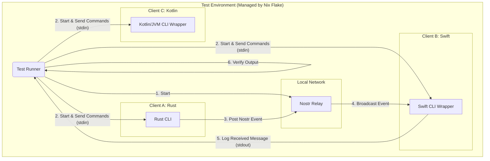

# Bitchat Integration Simulator Architecture

This document outlines a comprehensive testing architecture for ensuring cross-client compatibility between the Rust, Swift, and Kotlin implementations of the Bitchat protocol. The simulator uses a local Nostr relay for communication and is managed within a reproducible environment provided by Nix Flakes.

## 1. Overview

The goal of the integration simulator is to automate the process of testing interoperability between different Bitchat clients. The system will:
1.  Start a local, private Nostr relay.
2.  Launch instances of the Rust, Swift, and Kotlin Bitchat clients.
3.  Use a central **Test Runner** to send commands to each client (e.g., "send a message," "discover peers").
4.  Observe the output of each client to verify that actions are completed successfully and that messages are received correctly by other clients.
5.  Use **Nix Flakes** to define a fully reproducible environment, ensuring that all dependencies for all three client implementations are managed declaratively.

## 2. Architecture Diagram



## 3. Components

### 3.1. Test Runner

The Test Runner is the orchestrator of the entire simulation. It is a script or application (e.g., written in Python, Rust, or even a shell script) that performs the following actions:
*   **Starts and stops** the Nostr relay and all client processes.
*   **Sends commands** to each client's standard input (stdin).
*   **Reads and parses** the standard output (stdout) of each client to check for expected outcomes (e.g., "Message sent," "Received message from...").
*   **Asserts correctness** of test scenarios and reports success or failure.

### 3.2. Local Nostr Relay

A standard Nostr relay will be run locally to act as the communication backbone. This avoids reliance on public relays and creates a controlled, private network for testing.
*   **Implementation**: We will use a lightweight, Rust-based relay like `nostr-rs-relay` for consistency with our tech stack.
*   **Configuration**: The relay will be configured with no authentication and will run on a local port (e.g., `ws://localhost:8080`).

### 3.3. Client Implementations

*   **Rust Client**: The `bitchat-cli` application will be used directly. It already has a command-line interface that can be driven by the Test Runner.
*   **Swift and Kotlin Clients**: The existing Swift (iOS/macOS GUI) and Kotlin (Android GUI) implementations will need simple **CLI wrappers**. These wrappers will be new, test-only applications that:
    *   Import the core Bitchat protocol logic from their respective codebases.
    *   Expose a simple command-line interface for actions like `send`, `list-peers`, etc.
    *   Read commands from stdin and print results to stdout.
    *   This avoids the complexity of trying to automate GUI applications.

### 3.4. Nix Flake

The Nix Flake is the cornerstone of this architecture, providing a fully reproducible development and testing environment. The `flake.nix` file will define:
*   **Inputs**: The specific versions of the Rust, Swift, and Kotlin toolchains.
*   **Packages**:
    *   `bitchat-rust-cli`: A package for building the Rust CLI.
    *   `bitchat-swift-wrapper`: A package for building the Swift CLI wrapper. This will involve using Nix's `build-support/darwin` tools.
    *   `bitchat-kotlin-wrapper`: A package for building the Kotlin/JVM CLI wrapper. This will use Nix's `gradle-nix-plugin` or a similar mechanism.
    *   `nostr-relay`: A package for the local Nostr relay.
*   **`devShell`**: A development shell that provides all the necessary tools and dependencies to build, run, and test all components of the simulator. Running `nix develop` will drop the user into an environment where they can immediately run the simulation.

## 4. Client CLI Wrapper Interface

To allow the Test Runner to control the Swift and Kotlin clients, their CLI wrappers should support a simple, text-based command interface. For example:

```bash
# Start the client with a specific name and relay
start --name "swift-client" --relay "ws://localhost:8080"

# Send a broadcast message
send "Hello from Swift!"

# Send a private message to a peer
send --to <peer_id> "This is a private message."

# List discovered peers
list-peers
```

The client wrappers would print status updates and received messages to stdout in a simple, parsable format, e.g.:

```
[STATUS] Connected to relay ws://localhost:8080
[SENT] Message ID: <message_id>
[RECEIVED] From: <peer_id> | Message: "Hello from Rust!"
```

## 5. Test Scenario Workflow Example

Here is a step-by-step workflow for a simple test case: "Rust client sends a message, and Swift client receives it."

1.  **Setup**: The Test Runner starts the local Nostr relay.
2.  **Launch Clients**: The Test Runner launches the `bitchat-rust-cli` and `bitchat-swift-wrapper` processes. It sends the `start --name ...` command to each.
3.  **Action**: The Test Runner sends the command `send "Hello from Rust!"` to the Rust client's stdin.
4.  **Observation (Rust)**: The Test Runner reads the Rust client's stdout and waits for a `[SENT] ...` message to confirm the message was sent.
5.  **Observation (Swift)**: The Test Runner reads the Swift client's stdout and waits for a `[RECEIVED] ... Message: "Hello from Rust!"` message.
6.  **Verification**: If the expected output is received from both clients within a timeout, the test case passes.
7.  **Teardown**: The Test Runner terminates all client processes and the Nostr relay.

## 6. Benefits of this Architecture

*   **Reproducibility**: The Nix Flake guarantees that every developer and the CI/CD pipeline will use the exact same dependencies and toolchains, eliminating "it works on my machine" problems.
*   **Automation**: The Test Runner can automate a large suite of complex, multi-client test scenarios, which would be impossible to perform manually.
*   **High-Fidelity Testing**: This setup tests the full stack of each client, from the command-line interface down to the network transport, providing a high degree of confidence in the implementation.
*   **Protocol Conformance**: It provides a practical way to enforce that all client implementations are conforming to the Bitchat protocol specification.
*   **Regression Testing**: The simulator can be run automatically in CI to catch any cross-client compatibility regressions before they are merged.
